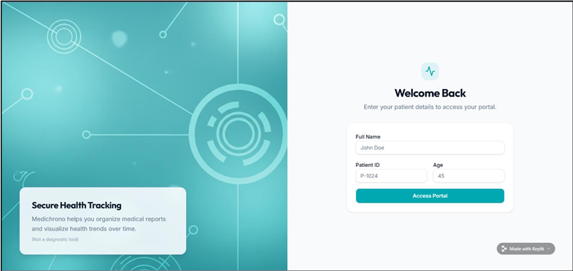
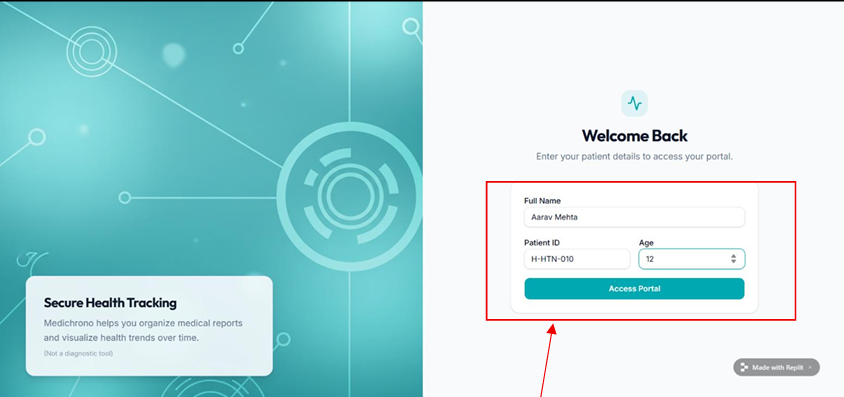
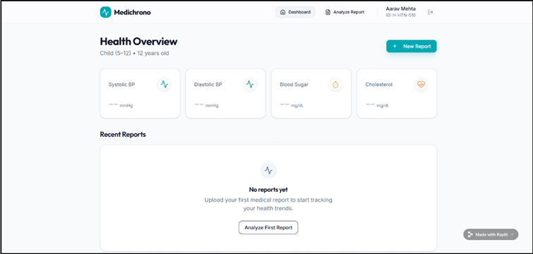
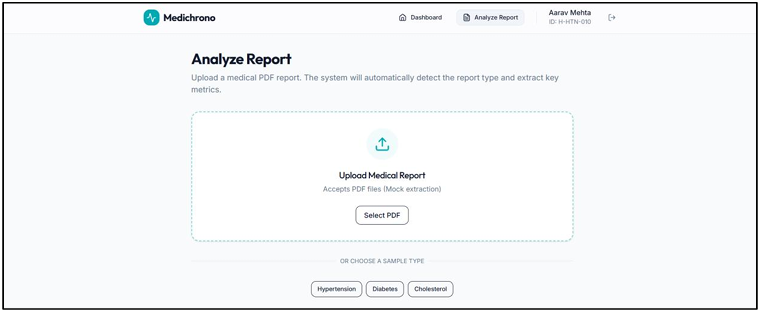
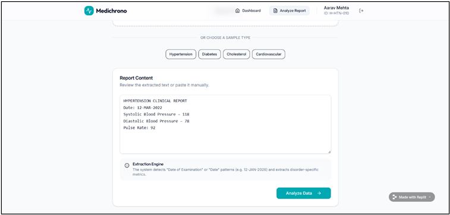
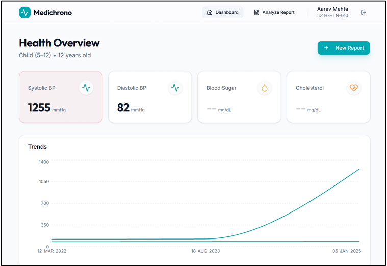
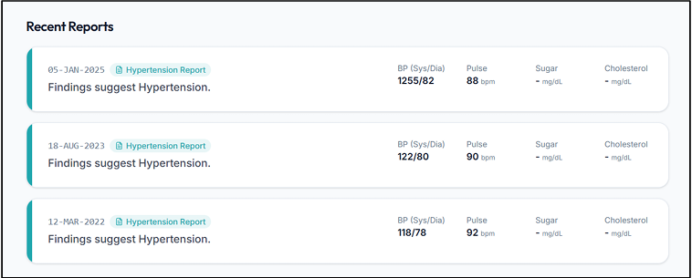
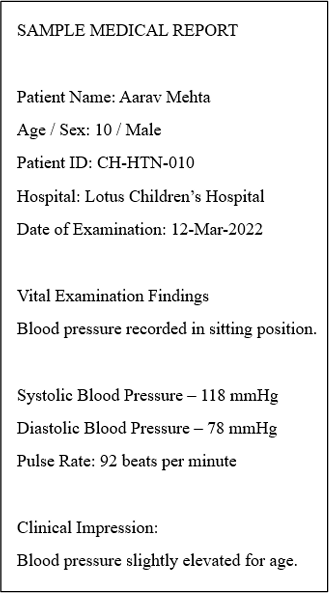
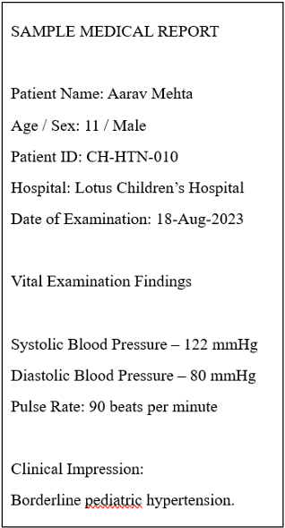
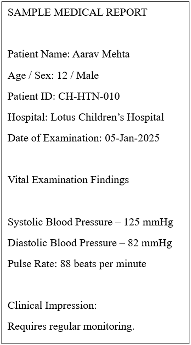

# MediChrono

A rule-based web application for medical report extraction and chronological health record management — built with Ruby and Sinatra.

---

## About

This project was developed as part of the M.Sc. Bioinformatics (Part II) curriculum at **Guru Nanak Khalsa College of Arts, Science & Commerce (Autonomous)**, Academic Year 2025–2026.

---

## What It Does

MediChrono lets a patient upload PDF laboratory reports. The system automatically extracts clinical parameters using rule-based text parsing (no machine learning), then organizes them into a chronological health timeline per patient.

```
Patient uploads PDF → Text extracted → Report type detected → Parameters parsed → Timeline updated
```

### Extracted Parameters

| Report Type | Parameters Extracted |
|---|---|
| Hypertension | Systolic BP, Diastolic BP, Pulse Rate |
| Diabetes | Blood Sugar |
| Cholesterol | Cholesterol level |
| Cardiovascular | Systolic BP, Diastolic BP, Pulse Rate |

---

## Screenshots

**Homepage / Login:**



**Entering patient details:**



**Dashboard after login:**



**Upload report page:**



**Extracted report content ready for analysis:**



**Trend visualization after uploading multiple reports:**



**Chronological history with values and dates:**



**Sample medical reports used for testing (Aarav Mehta — Hypertension):**





---

## Tech Stack

| Layer | Technology |
|---|---|
| Language | Ruby |
| Web Framework | Sinatra (DSL) |
| PDF Parsing | `pdf-reader` gem |
| Data Storage | In-memory (Ruby Hashes) |
| Frontend | ERB + CSS (inline) |

---

## Setup

### Requirements
- Ruby 2.7+
- Bundler

### Install dependencies

```bash
bundle install
```

### Run the app

```bash
ruby app.rb
```

Then open your browser at: `http://localhost:4567`

---

## How to Use

1. Open the app and enter a patient name, patient ID, and age.
2. Click **Access Portal** to reach the dashboard.
3. Upload a PDF medical report using the file input.
4. The system detects the report type and extracts parameters automatically.
5. View the organized medical history in chronological order on the dashboard.
6. Upload multiple reports for the same patient to build a timeline.

---

## System Workflow

```
User Interface (Sinatra)
        ↓
PDF Processing (pdf-reader gem)
        ↓
Rule-Based Extraction Engine (Ruby Regex)
    ├── Date Identification
    ├── Report Type Detection (keyword scan)
    └── Parameter Matching
        ↓
In-Memory Patient History (Ruby Hash)
        ↓
Dashboard (ERB Templates)
```

---

## Limitations

- Fixed regex patterns — reports with unusual formatting may not parse correctly.
- No authentication or access control in this prototype.
- Limited to 4 disorder types: Hypertension, Diabetes, Cholesterol, Cardiovascular.
- In-memory storage only — data is lost when the server restarts.
- Standalone app — no integration with external EHR or hospital systems.
- Image-based or scanned PDFs are not supported (no OCR).

---

## Future Prospects

- Add persistent database storage (PostgreSQL or SQLite) for long-term record keeping.
- Implement secure user authentication and role-based access control.
- Expand parameter coverage to include CBC, liver function tests, kidney function tests.
- Introduce graphical trend charts and downloadable health summaries.
- Enable interoperability with hospital information systems.
- Deploy on cloud platforms with mobile compatibility.
- Consider hybrid rule + explainable-AI models for handling complex unstructured reports.

---

## References

1. JAMIA. Organizing and reasoning over temporal events in EHRs. https://academic.oup.com/jamia
2. BMC Medical Informatics. Applying text-mining to clinical notes. https://bmcmedinformdecismak.biomedcentral.com
3. ScienceDirect. Reconstructing patient natural history from EHRs. https://www.sciencedirect.com
4. PMC. Clinical information extraction applications: A literature review. https://pmc.ncbi.nlm.nih.gov
5. arXiv. HeaRT: Health Record Timeliner. https://arxiv.org/abs/2306.14379
6. Sinatra DSL. https://sinatrarb.com
7. RubyGems — pdf-reader. https://rubygems.org/gems/pdf-reader

---

## Note

MediChrono is a prototype for educational and demonstration purposes. It is not a certified medical device and should not replace professional clinical record systems.
